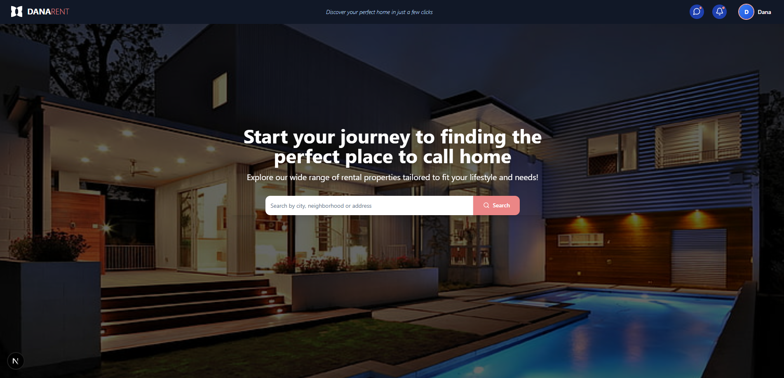
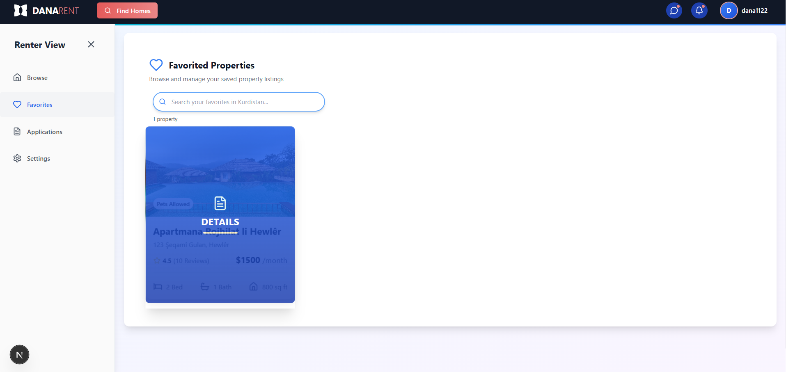
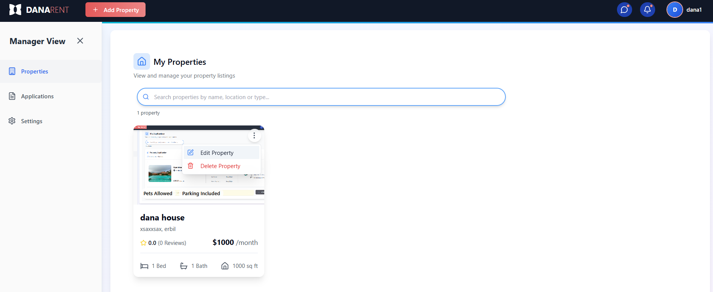
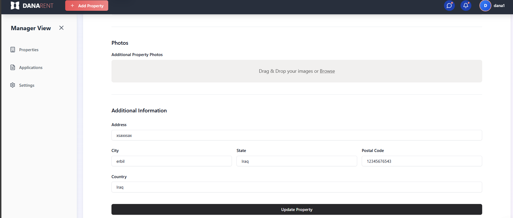
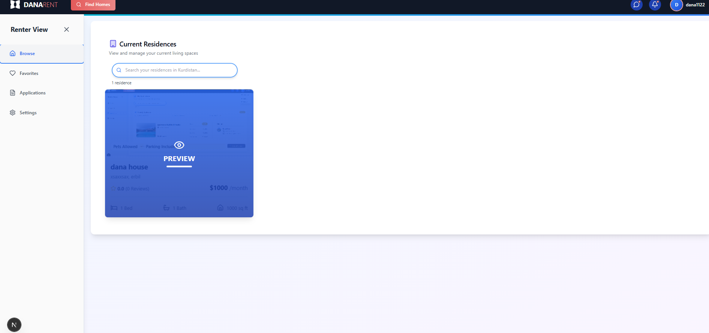
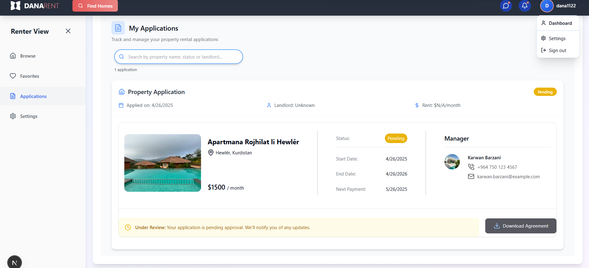
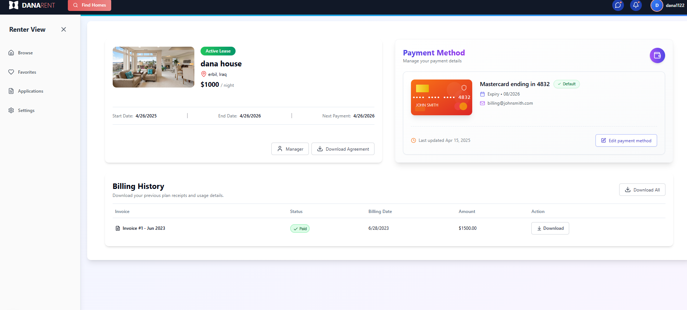

# DanaRent Real Estate Platform 🏡

## Overview
DanaRent is a comprehensive real estate platform that connects property managers with tenants seeking quality rental properties.  
The application features separate dashboards tailored for different user types, offering specialized tools for property managers to list and manage properties, and for tenants to find, save, and apply for rental homes.

---

## ✨ Features

### For Property Managers
- **Property Management:** Add, edit, delete, and view rental properties
- **Application Review:** Process rental applications
- **Tenant Management:** Track tenants and lease details
- **Payment Tracking:** Monitor rent payments and history

### For Tenants
- **Property Search:** Browse and filter properties
- **Application Submission:** Apply directly through the platform
- **Favorites Management:** Save and organize properties
- **Lease Management:** View lease information and payment status

### For All Users
- **User Authentication:** Secure login and registration
- **Responsive Design:** Optimized for mobile and desktop
- **Interactive UI:** Animated, modern user experience

---

## 🛠️ Tech Stack

**Frontend:**
- Next.js (React Framework)
- React
- TypeScript
- Tailwind CSS

**UI Enhancements:**
- Framer Motion
- Lucide Icons
- React Hook Form
- Zod

**State Management:**
- Redux Toolkit
- RTK Query

**Authentication:**
- AWS Amplify

**Maps Integration:**
- Mapbox

**Backend:**
- Express.js
- Prisma ORM
- PostgreSQL

---

## 📄 Key Pages and Screenshots

### Landing Page
- Hero section with search
- Features overview
- Registration CTA

---

### Property Search Page
- List and Map views
- Filters (price, beds, amenities)
- Save favorites

---

### Property Details Page
- Photos gallery
- Full specifications
- Map location

---

### Manager Dashboard
- Property portfolio overview
- Key metrics
- Application notifications

---

### Property Management Page
- View, filter, and manage properties
- Add new listings

---

### Property Edit Page
- Update property details and images

---

### Applications Management Page
- Review tenant applications
- Approve/Deny requests

---

### Tenant Dashboard
- Current residence info
- Favorite properties
- Payment tracking

---

### Tenant Residences Page
- View rented properties
- Lease and payment details

---

### Tenant Favorites Page
- Manage saved properties

---

### Tenant Applications Page
- Track application status

---

### Payment Management Page
- Payment history
- Upcoming rent schedule

---

## 📱 Responsive Design
DanaRent provides a seamless, touch-friendly experience across all devices, including mobile with bottom navigation optimizations.

